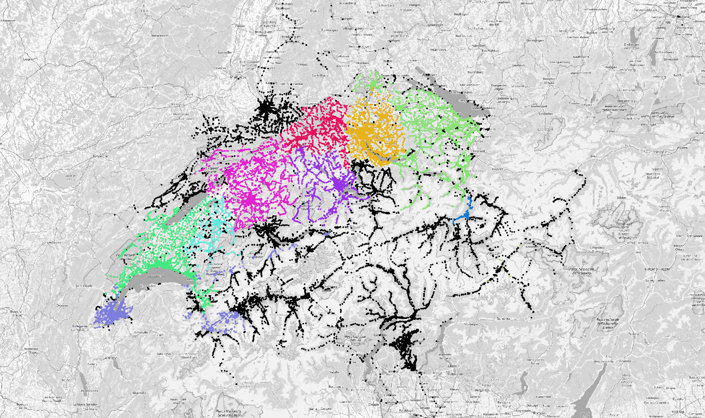

# Public Transport Utilities for Switzerland



> DISCLAIMER: This documentation is written from the perspective of the Switzerland
> MATSim scenario. However, all of these tools are useful for other use cases as
> well, e.g. Sao Paulo or Paris. At the moment, all components are rather generic
> except for the public transit cost calculation. There neither the data nor code
> are written in a generic way, which will happen soon. By then this repository will
> become a _matsim_pt_utils_ or _ivt_pt_utils_ package rather than _ch_pt_utils_.
> Maybe things will even be structured in a way that there are separate repositories
> for the use cases and one central one for the generic tools.

This repository contains a collection of tools for PT routing and pricing in
Switzerland. It consists of two major parts: One part that is mainly used for
preparing raw data (such as the T603 tarif document) and one part that integrates
this data into MATSim / SwissRailRaptor. Finally, there is a public transit routing
server that offers an API and a simple web interface.

## Preparation

All data preparation is found in `/preparation`. In principle, the script
`/preparation/prepare.sh` should do all the work. It requires four input
parameters, which are:

1. Path to the HAFAS data set (i.e. a directory containing `BFKOORD_GEO`)
2. Path to the tarif data. It should contain the following files:
   - `t603.pdf`, the T603 SBB tarif information
   - `t603_bold.raw.txt`, a manually created list of station ids that are written in **bold** in T603 (this will probably not be needed anymore in future versions)
   - `t651.{authority}.pdf`, all T651 tarif documents for the transport authorities in Switzerland. Currently, these are `awelle`, `engadin_mobil`, `frimobil`, `libero`, `ostwind`, `passepartout`, `transreno`, `tvsz`, `tvzg`, `unireso`, and `zvv`.
3. Path to a temporary directory. It will be used to perform some temporary file conversion.
4. Path to the output directory. Several files will be created here:
   - `t603.csv`, all the relevant information from T603 in digital form
   - `t603_bold.txt`, the **bold** station ids, properly formatted
   - `t651.csv`, a mapping of HAFAS station id to transport authorities and respective zones
   - `t651.hafas_mapped.shp`, a shape file containing all HAFAS stations with authority and zone information
   - `t651.convex_hulls.shp`, a shape file containing the convex hulls used to match HAFAS stations that could not be matched by name

To run the preparation scripts the following is needed:
- `python3` with `pandas` installed
- `pdf-stapler` command line utility to process PDF files [(see here)][1]
- `pdftotext` command line utility to process PDF files
- `python-docx` package via `pip` (to read e.g. TVSZ station data)

A full set of input files is currently located at `/nas/ivtmatsim/pt_data`. The HAFAS file can be found at `/nas/ivtmatsim/scenarios/switzerland/data/hafas/`.

## Java framework

The java package is located in `ch_pt_utils`. A fat-jar with all dependencies
included can be created using the `standalone` profile in the Maven pom.xml:

```
mvn -Pstandalone package
```

The resulting jar will be in `target/ch_pt_utils-{VERSION}.jar`. It can be used
to start, for instance, the batch router or the web service.

### Batch router

The package includes a batch router which makes it possible to route a list of
trips in an easy way. What needs to be provided is a csv file with the following
content:

```
request_id;origin_x;origin_y;destination_x;destination_y;departure_time
```

The coordinates should be given in the same projection as the transit schedule
(EPSG:2056 for Switzerland) and the departure time should be given in seconds
after midnight. The request id can be an arbitrary string.

The batch router is started as follows:

```
java -Xmx10G -cp ch_pt_utils-{VERSION}.jar ch.ethz.matsim.ch_pt_utils.routing.batch.RunBatchRouting [OPTIONS]
```

There are four mandatory options:
- `--network-path [PATH]` to a MATSim network file
- `--schedule-path [PATH]` to a MATSim schedule file
- `--requests-path [PATH]` to the CSV file mentioned above
- `--output-path [PATH]` to the output file path

Optional are the following settings:
- `--threads [NUMBER]` determines how many routing threads will be used
- `--batch-size [NUMBER]` determines how many requests are buffered in each routing cycle on a thread, a default value of 100 should be fine in most cases except when there are so many threads that the I/O operations are leading to thread locking each other temporarily
- `--parameters-path [PATH]` to a `json` file containing a number of parameters that can be set for the routing. Check the class `ch.ethz.matsim.ch_pt_utils.routing.RoutingParameters` for more information.

The program will create an output CSV file with information about the routing.

The configuration parameters can look as follows:

```json
{
    "walkSpeed": 1.2,
    "walkBeelineDistanceFactor": 1.3,
    "walkBeelineConnectionDistance": 100.0,
    "minimalTransferTime": 0.0,
    "searchRadius": 1000.0,
    "extensionRadius": 200.0,

    "beforeDepartureOffset": 1800.0,
    "afterDepartureOffset": 1800.0,

    "scheduleWrappingEndTime": 108000.0,

    "utilities": {
        "waitingTime": -3.0,
        "numberOfTransfers": -0.2,

        "accessWalkTime": -5.0,
        "egressWalkTime": -5.0,
        "transferWalkTime": -5.0,
        "directWalkTime": -5.0,

        "railInVehicleTime": -0.1,
        "subwayInVehicleTime": -0.1,
        "inVehicleTime": -0.1
    }
}
```

In case no specific utilities for `access`, `egress`, etc. are given, the value from
`walkTime` is read, which is enforced to be present in that case. The same is true for
the vehicular modes: If there is no a specific one available (e.g. `railInVehicleTime`),
the value is fetched from `inVehicleTime`. If it is not present, an exception is
thrown. The utilities for waiting time and transfers must be present.

### Web service

All the code for the web service is located in `ch.ethz.matsim.ch_pt_utils.server`.
The main script is `ch.ethz.matsim.ch_pt_utils.server.RunRoutingServer`. It requires
a number of input arguments:

1. The port on which to listen for the web service.
2. Path to `switzerland_transit_schedule.xml.gz`
3. Path to `switzerland_network.xml.gz`
4. Path to `t651.csv` (from the preparation output)
5. Path to `t603.csv` (from the preparation output)
6. Path to `t603_bold.txt` (from the preparation output)

Furthermore, the server requires a working installation of [GLPK for Java][2]. Note
that it is usually necessary to build it manually and put it for instance in `~/glpk`.

An example how to run:

```
java -Xmx10G -Djava.library.path=~/glpk/lib/jni ch.ethz.matsim.ch_pt_utils.server.RunRoutingServer 7050 switzerland_transit_schedule.xml.gz switzerland_network.xml.gz t651.csv t603.csv t603_bold.txt
```

Once the web service is running it can be accessed via `http://localhost:7050`. It is also possible
to contact the API directly, e.g.:

```
curl -X POST -H "Content-Type:application/json" http://localhost:7050/ -d '{"trips": [{"originLatitude" : 47.409311, "originLongitude" : 8.506979, "destinationLatitude" : 47.412746, "destinationLongitude" : 9.438905, "departureTime" : 32400.0}]}'
```

[1]: https://pypi.org/project/stapler/
[2]: http://glpk-java.sourceforge.net/gettingStarted.html
